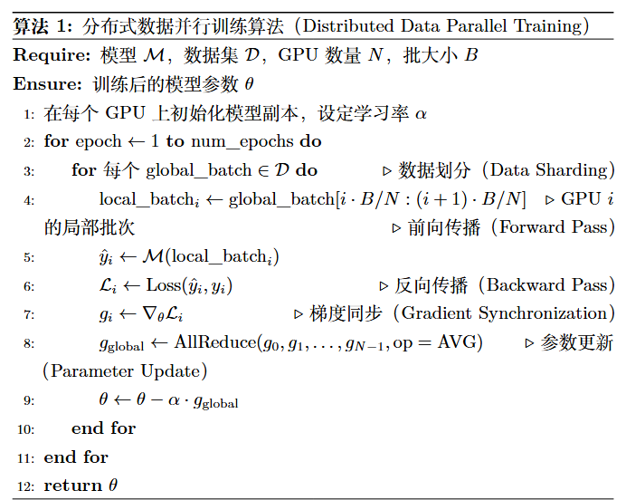
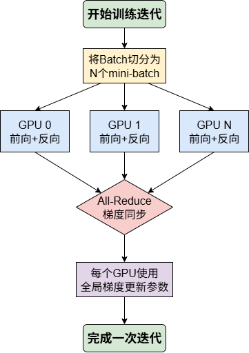
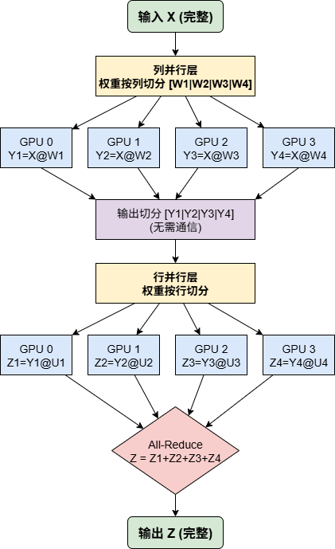
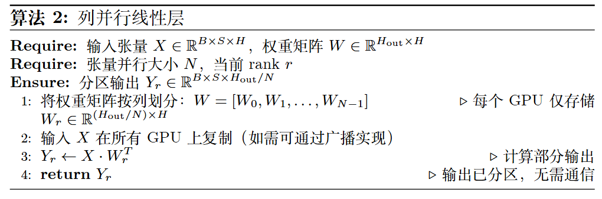
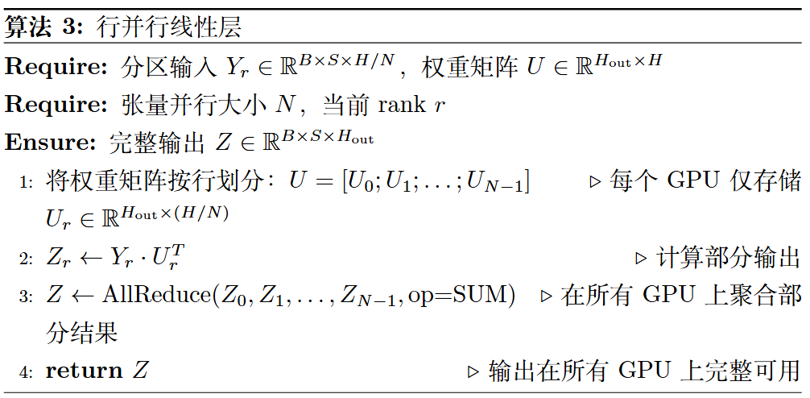
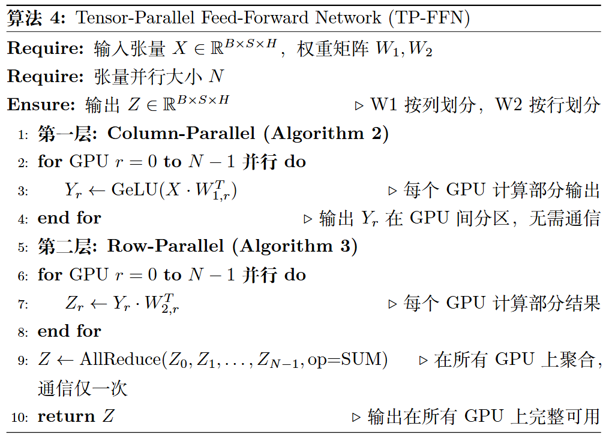
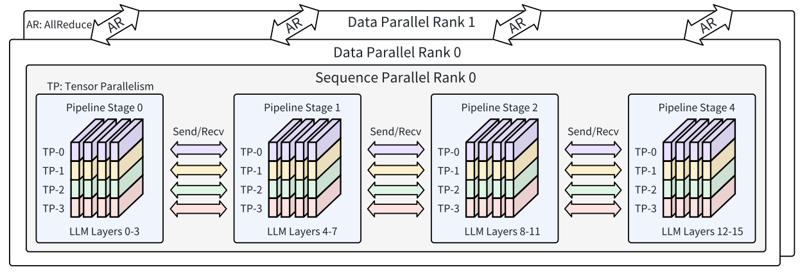

<!--Copyright © ZOMI 适用于[License](https://github.com/Infrasys-AI/AIInfra)版权许可-->

# SPTD并行与稠密模型

> Author by: 于嘉阔

随着大语言模型参数量的持续增加，单机单卡的算力与显存已远远无法满足其训练需求。传统的数据并行或单一的模型并行策略，在面对数百亿乃至万亿参数模型时，效率和可扩展性均遇到瓶颈。为此，业界逐步形成了一套融合多种并行思路的混合框架，即SPTD并行。

SPTD并行之所以高效，是因为它涵盖的四个策略分别解决了不同维度的挑战。其中，序列并行（Sequence Parallelism, SP）专注于应对日益增长的序列长度带来的显存压力；流水线并行（Pipeline Parallelism, PP）解决了模型深度过大而无法单机容纳的难题；张量并行（Tensor Parallelism, TP）则攻克了模型宽度（即单层参数量过大）的瓶颈；而数据并行（Data Parallelism, DP）则从根本上扩展了数据吞吐能力，实现了规模化加速。

通过混合使用这些策略，训练系统能够充分利用硬件资源，实现跨节点、跨设备的高效协同训练。在这一节中，我们将以稠密模型为核心对象，系统阐述SPTD并行的基本概念、应用方式以及工程实践，帮助读者理解当前大模型训练的主流技术路径。

## SPTD并行概念

SPTD并行是一种面向超大规模稠密模型的混合并行训练范式，通过在不同维度上分解计算与存储负载，并映射到不同层次的硬件架构，最大化算力利用率并降低通信瓶颈。

（1）数据并行（Data Parallelism, DP）

数据并行是最为经典且广泛应用的并行策略，其核心思想可以概括为“模型复制，数据分片”。在数据并行模式下，每个参与训练的GPU都会保有一份完整的模型副本。训练开始时，一个大的数据批次（Batch）会被切分成多个子批次（mini-batch），并分发给不同的GPU。每个GPU独立地对自己分到的数据进行前向传播计算损失，再进行反向传播计算出梯度。至此，每个GPU都基于自己的数据完成了对模型参数的“修改意见”。下一步是同步这些意见，这一聚合步骤的有效性源于梯度计算的基本数学原理：

$$
\frac{\partial Loss(D)}{\partial w} = \frac{\partial \frac{1}{N} \sum_{i=1}^{N} Loss(x_i, y_i)}{\partial w} = \frac{1}{N} \sum_{i=1}^{N} \frac{\partial Loss(x_i, y_i)}{\partial w}
$$

如公式所示，对于整个数据批次$D$的总损失$Loss(D)$，其关于模型权重$w$的梯度，在数学上等价于分别计算每个数据样本$(x_i, y_i)$的损失梯度，然后将所有这些梯度求和再取平均。这一原理正是数据并行得以实施的基础。它允许每个 GPU 独立地计算自己那一小部分数据的梯度$\frac{\partial Loss(x_i, y_i)}{\partial w}$。随后，通过 All-Reduce 这样的集体通信操作，高效地完成所有梯度的求和与平均，从而得到对整个批次数据的正确全局梯度。最后，每个GPU都使用这个全局梯度来更新本地的模型参数副本，确保在下一次迭代开始前，所有设备上的模型权重保持严格一致。

早期的DP实现，如PyTorch-DDP[1]，虽然易于实现且能有效提升训练吞吐量，但并未解决根本的显存瓶颈，因为每个GPU仍需承载完整的模型、梯度和优化器状态。为了攻克这一难题，以DeepSpeed 中的ZeRO（Zero Redundancy Optimizer）[2] 和PyTorch的FSDP（Fully Sharded Data Parallelism）[3] 为代表的全分片数据并行（Full Sharding）技术应运而生。这类技术不仅分片数据，还将模型参数、梯度和优化器状态也一并分片到所有GPU上。在计算过程中，每个GPU仅在需要时通过All-Gather通信从其他GPU动态地收集完整的网络层参数，计算完成后立即丢弃，极大地降低了单个GPU的峰值显存占用[2, 3]。这种“化整为零”的策略使得训练千亿甚至万亿参数模型成为可能，尽管它也带来了更为复杂的通信开销。数据并行本质上是一种向外扩展（Scale-out）的策略，通过增加计算设备来处理更多数据，是提升训练集群整体计算效率的基石。

    
     
    <em>算法1：分布式数据并行训练</em>

下面来介绍DDP算法。如算法1及图1所示，DDP的核心流程可清晰地分为几个阶段：首先，一个大的数据批次被切分（Data Sharding）后分发给各个GPU（算法1第4行）。接着，每个GPU在本地独立的进行前向和反向传播，计算出局部梯度（算法1第5-7行）。关键的第三步是梯度同步（Gradient Synchronization），所有GPU通过一次All-Reduce操作高效地聚合梯度，确保每个GPU都获得一致的全局梯度（算法1第8行）。最后，每个GPU使用这个全局梯度更新参数（算法1第9行），完成一次迭代并保持所有模型副本的一致性。这种方式的优点是实现简单，但其主要瓶颈在于每个GPU仍需承载完整的模型、梯度和优化器状态，在模型规模较大时容易导致显存不足。

    
     
    <em>图1：数据并行单次迭代流程图</em>

（2）张量并行（Tensor Parallelism, TP）

当模型的单层规模大到单个GPU无法容纳时，数据并行便无能为力。此时，张量并行提供了一种解决方案，其核心思想是将单个神经网络层内部的大规模矩阵运算，分解到多个GPU上协同完成。最具代表性的实现是NVIDIA的Megatron-LM[4]，它通过巧妙地组合列并行（Column Parallelism）和行并行（Row Parallelism）来优化计算与通信流程（如图二所示）。

    
     
    <em>图2：张量并行应用于前馈网络的计算与通信流程图</em>

这里，列并行和行并行是针对线性层 $Y = XA$ 的两种不同切分方式。列并行是指将权重矩阵 $A$ 按列切分，即 $A = [A_1, A_2, ...]$。在这种模式下，每个GPU计算 $Y_i = XA_i$，最终的输出 $Y$ 是所有部分结果的拼接 $Y = [Y_1, Y_2, ...]$，这个过程是分散的，通常不需要通信。而行并行则是指将权重矩阵 $A$ 按行切分，即 $A = [A_1; A_2;...]$。此时，输入 $X$ 也需要是按列切分的 $X = [X_1, X_2, ...]$，每个GPU计算 $Y_i = X_iA_i$，最终的输出 $Y$ 是所有部分结果的加和 $Y = Y_1 + Y_2 + ...$，这个过程需要通过 All-Reduce 通信来完成聚合。

在Transformer的前馈网络（FFN）中，$Z = \text{Dropout}(\text{GeLU}(XW_1)W_2)$，Megatron-LM正是利用了这两种并行方式的特性，将其精妙地结合起来。首先，第一个线性层采用列并行策略（如算法2所示），其权重矩阵 $W_1$ 被按列切分。完整的输入 $X$ 被复制到每个GPU上，并行地计算出中间结果 $Y_r = \text{GeLU}(X \cdot W_{1,r})$。在这一步之后，逻辑上完整的中间激活 $Y$ 在所有GPU上是分散存储的，每个GPU只持有其中的一部分，这完全符合列并行的输出特性。

    
     
    <em>图2：张量并行应用于前馈网络的计算与通信流程图</em>

接着，第二个线性层采用行并行策略（如算法3所示），其权重矩阵 $W_2$ 被按行切分。设计的关键之处在于，行并行所需要的分散输入，恰好由前一层列并行的分散输出完美提供了。因此，每个GPU可以直接利用 $Y_r$ 作为输入，计算出局部的最终结果 $Z_r = Y_r \cdot W_{2,r}$。通过这种方式，从而省略了在两层之间进行数据聚合（如All-Gather）的通信步骤。

    
     
    <em>算法3：行并行线性层</em>

最后，所有GPU上计算出的局部结果 $Z_r$ 通过一次All-Reduce通信操作相加聚合，得到完整的最终输出 $Z$（如算法4所示）。这种设计使得整个FFN块的计算只需要在最后进行一次通信，极大地优化了效率。

    
     
    <em>算法4：张量并行前馈网络</em>

（3）流水线并行（Pipeline Parallelism, PP）

与张量并行在层内“横向”切分不同，流水线并行是一种“纵向”切分策略。它将整个模型的上百层网络按顺序切分成多个连续的阶段，每个阶段由一个或一组GPU负责。数据像在工厂流水线上一样，在一个阶段上完成计算后，其输出（激活值）作为下一个阶段的输入，依次流经所有阶段，最终完成一次完整的前向传播。反向传播也以类似的方式进行，梯度从最后一个阶段反向传播至第一个阶段。这种模式天然地将模型按深度分散到不同设备，非常适合跨节点、跨服务器的场景，因为它对节点间的通信带宽要求远低于张量并行。

    
     
    <em>图3：流水线并行核心步骤示意图</em>

流水线并行面临的主要挑战是“流水线气泡（Pipeline Bubble）”，即在流水线的启动和排空阶段，部分GPU处于空闲等待状态，导致计算资源利用率下降。为了最小化气泡，现代流水线并行方案（如GPipe[5]和PipeDream[6]）引入了微批次（Micro-batch）和“1F1B（One Forward, One Backward）”调度策略。它将一个大批次数据切分成许多微批次，并交错执行前向和反向传播。当一个微批次在一个阶段完成前向计算后，立刻被送入下一阶段，而不是等待整个大批次完成。同时，一旦某个微批次的后向计算条件满足，它就会被立即调度。这种精细的调度策略使得GPU能够更紧密地衔接工作，显著减少了空闲时间。此外，如何平衡各个流水线阶段的计算负载，避免“木桶效应”，也是一个关键的优化问题，需要复杂的模型分区算法来解决。流水线并行以其较低的通信频率和对模型深度的有效切分，成为连接多个计算节点、构建超大规模训练集群的关键技术。

（4）序列并行（Sequence Parallelism, SP）

随着模型对长文本理解能力的需求日益增长，Transformer模型的输入序列长度急剧增加，这给训练带来了新的挑战。自注意力机制的计算和显存复杂度与序列长度的平方成正比，当序列变得极长时，存储激活值（尤其是KV Cache）的显存开销会成为新的瓶颈。序列并行正是为解决这一问题而设计的。它沿着序列长度维度对输入数据进行切分，而不是像TP或PP那样在模型宽度或深度上切分。每个GPU只处理输入序列的一个片段（Chunk）。

在Transformer层中，对于非依赖序列上下文的计算，如FFN中的部分运算和LayerNorm，各个GPU可以完全独立地对自己的序列片段进行计算，无需通信。真正的挑战在于自注意力模块，因为它要求每个Token都能关注到序列中的所有其他Token。为了实现这一点，序列并行通常采用环形通信（Ring-based）模式。例如，在Ring Self-Attention中，每个GPU在计算注意力时，会将其持有的Key和Value张量片段传递给环上的下一个GPU，同时接收来自上一个GPU的片段[7]。通过多轮这样的环形传递，每个GPU最终都能让自己的Query片段与完整的Key/Value序列进行交互，从而计算出正确的注意力结果。这种方式巧妙地将巨大的KV Cache分散存储在所有参与的GPU上，并结合选择性激活重计算等技术减少显存占用[8]。DeepSpeed-Ulysses等更先进的技术进一步优化了序列并行，通过All-to-All通信在序列维度和注意力头维度之间切换分片，使其能与FlashAttention等高效算子无缝结合[9]。序列并行是实现百万级甚至更长上下文窗口模型训练的核心技术，它专门解决了由超长序列带来的显存和计算难题。

为了更清晰地理解这五种策略，我们从多个维度进行对比：

| 策略 | 核心思想 | 切分对象 | 主要解决问题 | 通信瓶颈 |
| :--- | :--- | :--- | :--- | :--- |
| **SP**(序列并行) | 序列切分，逐块计算 | 输入数据的 序列维度 | 注意力计算中 序列过长导致 显存爆炸 | 激活值的 All-Gather |
| **PP**(流水线并行) | 层间并行，模型分段 | 模型的多个 连续层 | 整个模型太大， 单卡放不下 | 阶段间的 激活值传递 |
| **TP**(张量并行) | 层内并行，张量切分 | 模型层的 权重矩阵 | 单个层太大， 单卡放不下 | 激活值的 All-Reduce |
| **DP**(数据并行) | 模型复制，数据切分 | 训练数据 Batch | 训练速度慢， 需要更大 Batch Size | 梯度 All-Reduce |

在实践中，为了最大限度地利用硬件资源并突破不同层面的瓶颈，各种并行策略很少被孤立使用。通常，数据并行、流水线并行和张量并行会被组合成一个强大的框架，这通常被称为“3D并行”。然而，随着模型对长上下文处理能力的需求日益增长，序列并行（SP）的加入，使得这个框架演化为更为全面和强大的“4D并行”策略。

    
     
    <em>图4：数据并行、流水线并行与张量并行组合的3D并行架构示例</em>

上图虽然常被用作3D并行的经典示例，但其内在逻辑已然揭示了4D并行的分层架构。该架构可以从外到内分解为多个层次，每一层都旨在解决一个特定的系统瓶颈：

最外层是数据并行（DP），它通过复制整个模型来扩展训练的吞吐率。如图中的Data Parallel Rank 0和Data Parallel Rank 1所示，它们各自处理不同的数据，并在迭代结束时通过AR (AllReduce)同步梯度，从而实现对更多计算集群的横向扩展。

向内一层是流水线并行（PP），它将模型按深度（层）纵向切分，以容纳巨大的参数量。图中的多个Pipeline Stage代表了这种切分，它们通过Send/Recv在节点间传递数据。PP是实现跨服务器、跨节点进行模型参数规模扩展的关键。

最内层则是两种紧密耦合的并行策略的协同：张量并行（TP）与序列并行（SP）。这一层级专注于解决单个流水线阶段内部的计算和显存瓶颈，通常依赖于单机多卡环境下的高速互联带宽。张量并行（TP）将模型按宽度切分，如TP-0到TP-3所示，它们共同分担单个大算子（如前馈网络）的计算。序列并行（SP）则将输入数据按序列长度切分，图中Sequence Parallel Rank 0的标注正体现了这一点。TP和SP共同作用于同一组GPU上，TP解决了单层参数过大的问题，而SP解决了序列过长导致的显存和计算难题。

综上所述，这种从DP、PP到TP/SP的4D并行分层策略，通过在不同硬件层级应用最适合的并行技术，实现了对训练吞吐率、模型深度、模型宽度和序列长度这四个维度的全面扩展，是现代超大规模模型训练的标准范式。

## 稠密模型的特征

稠密模型（Dense Model）是当前大规模人工智能发展的主流范式，其核心特征在于参数的全量激活与计算参与。与稀疏模型中“部分激活”形成对比，稠密模型在训练和推理过程中会使用到模型的所有参数，这带来了以下显著特征：

（1）全参数参与计算

在稠密模型中，每一层的参数都会参与前向传播和反向传播。这种全量计算保证了模型的表达能力和优化一致性，但同时也使得计算量与内存消耗呈线性增长。随着参数规模从数十亿扩展到数千亿甚至万亿级别，单机单卡的显存和算力早已无法承载。

（2）显存占用与通信压力大

由于所有参数均需激活并存储梯度，稠密模型训练过程中会产生极高的显存开销。同时，在分布式环境下，参数同步与梯度聚合带来巨大的通信负担，特别是在跨节点场景中，这成为性能瓶颈之一。

（3）模型结构规则化，适合并行切分

大多数稠密模型，如GPT系列、LLaMA、BERT等，基于Transformer架构，其层与层之间具有高度重复性，单层内部的计算模式也相对固定。这种结构上的规律性，使其天然适合应用SPTD并行，通过序列维度、张量维度以及流水段的切分来优化训练效率。

（4）在大规模任务上的表现优势

稠密模型凭借全参数参与的特性，在语言建模、代码生成、跨模态对齐等复杂任务上展现出强大的通用性和鲁棒性。相比稀疏模型，其优化更稳定，对硬件和软件框架的依赖性更小，因此在工业界和学术界得到了最广泛的应用。

（5）计算与能耗代价高

稠密模型的高性能表现以极高的算力和能耗为代价。训练一个千亿参数规模的稠密模型往往需要数千块GPU的长期运行，这在成本和可持续性方面带来挑战，也推动了稀疏化和高效并行技术的研究。

综上所述，稠密模型的“全参数激活、计算负载巨大、结构高度规则化”特性，既凸显了其在大规模智能任务中的优势，也揭示了其训练过程中对高效并行框架（如SPTD）的强烈依赖性。正是这些特征，使得SPTD并行成为支撑稠密模型可扩展训练的核心技术之一。

## SPTD在稠密模型训练中的应用

稠密模型（Dense Model）指的是参数在网络层中普遍参与计算的模型架构，例如GPT、BERT及其衍生的大规模预训练语言模型。这类模型由于参数数量巨大、层数极深，训练过程中往往面临显存消耗过大、跨设备通信频繁和梯度同步开销显著等问题。传统的数据并行和张量并行虽然能够一定程度缓解计算与存储的压力，但在面对百亿甚至千亿规模的稠密模型时，仍难以兼顾内存利用率与通信效率。

（1）序列维度的切分优势

SPTD的核心思想是在稠密模型的序列维度上进行切分。以Transformer为例，输入序列长度可能达到4K–32Ktoken，若在单卡上完整计算，会导致注意力矩阵O(L2)的存储和计算压力骤增。通过将序列按片段切分并分布到多卡上，每张GPU仅需处理局部序列的注意力计算，从而有效降低激活存储和计算开销。这种方法与传统TP相比，能更好地匹配稠密模型在长序列输入下的计算特性。

（2）跨层并行与参数分布优化

在稠密模型的多层Transformer堆叠中，SPTD不仅在单层内部进行序列切分，还通过跨层并行策略实现计算与存储的解耦。模型的注意力机制和前馈网络模块往往呈现出不同的计算特性，SPTD能够根据模块特性在层间灵活分配序列片段，从而最大化并行度。此外，结合参数切分与梯度聚合策略，SPTD允许稠密模型参数按列或按块分布到不同设备中，使显存消耗与通信需求保持可控。

（3）训练效率与可扩展性提升

实践表明，SPTD对稠密模型的训练效率提升显著。例如在Megatron-LM等框架中，SPTD并行通过在序列、流水线、张量和数据维度上的切分，实现了百亿级稠密模型的高效训练。DeepSpeed框架则在ZeRO技术的基础上引入序列并行，以减少冗余激活存储并优化长序列训练的内存利用率。在PaLM和GPT-4的训练过程中，SPTD也被证明能够有效提升分布式集群的扩展效率，使得训练能够在上千张GPU上保持接近线性的加速比。

综上所述，SPTD并行通过在序列、张量、流水线和数据维度上的协同切分与调度，为稠密模型训练提供了高效的计算与通信优化路径。它不仅缓解了长序列输入下的显存和通信瓶颈，还在模型层内和跨节点扩展中实现了多维度并行协作，为超大规模稠密模型的训练奠定了基础。

## 参考与引用

1. Li, S., Zhao, Y., Varma, R., Salpekar, O., Noordhuis, P., Li, T., ... & Smith, J. (2020). Pytorch distributed: Experiences on accelerating data parallel training. *arXiv preprint arXiv:2006.15704*.
2. Rajbhandari, S., Rasley, J., Ruwase, O., & He, Y. (2020). Zero: Memory optimizations toward training trillion parameter models. In *SC20: International Conference for High Performance Computing, Networking, Storage and Analysis* (pp. 1-16). IEEE.
3. Zhao, Y., Gu, A., Varma, R., Luo, L., Huang, C. C., Xu, M., ... & Shleifer, S. (2023). Pytorch fsdp: Experiences on scaling fully sharded data parallel. *Proceedings of the VLDB Endowment, 16(12)*, 3848-3860.
4. Shoeybi, M., Patwary, M., Puri, R., LeGresley, P., Casper, J., & Catanzaro, B. (2019). Megatron-lm: Training multi-billion parameter language models using model parallelism. *arXiv preprint arXiv:1909.08053*.
5. Huang, Y., Cheng, Y., Bapna, A., Firat, O., Chen, D., Chen, M., ... & Le, Q. V. (2019). Gpipe: Efficient training of giant neural networks using pipeline parallelism. *Advances in neural information processing systems, 32*.
6. Narayanan, D., Harlap, A., Phanishayee, A., Seshadri, V., Devanur, N. R., Ganger, G. R., ... & Zaharia, M. (2019). Pipedream: generalized pipeline parallelism for dnn training. In *Proceedings of the 27th ACM symposium on operating systems principles* (pp. 1-15).
7. Li, S., Xue, F., Baranwal, C., Li, Y., & You, Y. (2023). Sequence parallelism: Long sequence training from system perspective. In *Proceedings of the 61st Annual Meeting of the Association for Computational Linguistics (Volume 1: Long Papers)* (pp. 2391-2404).
8. Korthikanti, V. A., Casper, J., Lym, S., McAfee, L., Andersch, M., Shoeybi, M., & Catanzaro, B. (2023). Reducing activation recomputation in large transformer models. *Proceedings of Machine Learning and Systems, 5*.
9. Jacobs, S. A., Tanaka, M., Zhang, C., Zhang, M., Aminabadi, R. Y., Song, S. L., ... & He, Y. (2024). System optimizations for enabling training of extreme long sequence transformer models. In *Proceedings of the 43rd ACM Symposium on Principles of Distributed Computing* (pp. 121-130).
