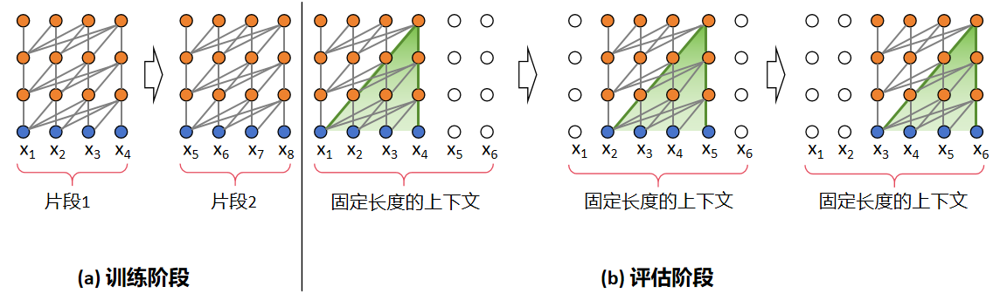
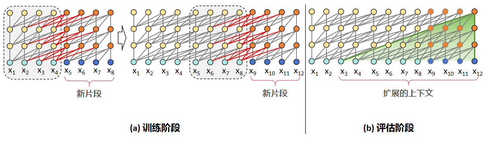
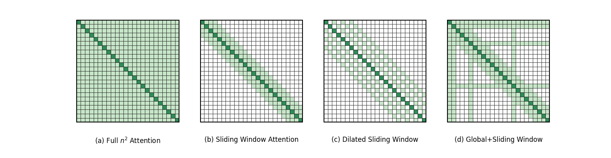

<!--Copyright © ZOMI 适用于[License](https://github.com/Infrasys-AI/AIInfra)版权许可-->

# 长序列与上下文并行 CP

> Author by: 杨涵智

!!!!!!!参考文章 https://zhuanlan.zhihu.com/p/698447429

随着AI对长文本处理需求的提升，早期的短上下文大模型因上下文截断的局限难以满足实际任务，人们对大模型的长序列处理能力的需求水涨船高。然而，传统的并行技术难以针对性解决因序列长度扩展带来的内存与效率瓶颈问题。为此，本节聚焦序列并行的进阶方案——上下文并行，系统阐述其基本原理、与传统技术的差异及核心优势，说明其如何支撑大模型的长序列处理能力高效落地。

## 长序列出现

大模型的长序列能力的爆发绝非偶然的技术迭代，而是伴随着人工智能向复杂真实场景渗透时，对长距离信息关联能力需求的必然产物。早起以BERT、GPT-2等512或1024 token窗口为代表的短上下文大模型虽然在简单任务中表现亮眼，但面对多轮复杂对话、文章理解等长序列场景时仍显得力不从心。上下文窗口的硬性限制，使得它们不得不对长文本进行截断，这直接导致了部分关键信息的丢失，使任务精度大幅度下降。以长文档摘要任务为例，短上下文大模型对跨段落核心观点的捕捉率甚至不能达到50%，完全无法达到产业级应用的标准。

鉴于短上下文模型受限于上下文窗口，所以人们首先以突破固定的上下文窗口为核心方向。2019年诞生的Transformer-XL就是这一阶段的代表性成果，并且成功证明了突破固定的上下文窗口对长序列建模的意义。Transformer-XL的核心优化在于引入了以下两点：

经典Transformer训练和评估阶段

Transformer-XL训练和评估阶段

1. 片段递归：Transformer-XL和Transformer相同点在于在训练时会以固定长度的片段进行输入，区别在于Transformer-XL会缓存上一片段的状态，重复使用上个时间片的隐层状态来计算当前片段。从图中可以直观地看出，在训练阶段，Transformer前后片段是独立的，显然这与事实不符，而Transformer-XL缓存了前一个片段的输出序列，在计算下一个片段的输出时会使用上一个片段的缓存信息，将前后片段的信息进行融合。在评估阶段，Transformer会采用同训练阶段一致的划分长度，仅预测最后一个位置的token，完成后整体向后移动一位，但是这种方式需要频繁计算新的片段，计算代价很大；相对的，由于前后片段的重复度很高，Transformer-XL选择直接使用前一个片段的输出序列，不需要重复计算，加快了推理速度。
2. 相对位置编码：以往Transformer使用绝对位置编码，其计算方式如下：

$$
\left\{
\begin{aligned}
PE(pos, 2i) &= \sin\left( \frac{pos}{10000^{2i/d_{\text{model}}}} \right) \\
PE(pos, 2i+1) &= \cos\left( \frac{pos}{10000^{2i/d_{\text{model}}}} \right)
\end{aligned}
\right.
$$

其中，pos表示token的下标，$d_{\text{model}}$表示hidden size，i表示的是具体的某个维度。从公式中不难看出，绝对位置编码只能在同一片段中区分位置，在不同片段中的同一位置的编码是相同的。如果按照这个方式计算，前后两段在进行信息融合时会造成位置信息的混乱。为了避免这一情况，Transformer-XL使用相对位置编码，通过计算当前token与其他token的相对距离，为不同相对位置分配特定的编码参数。这样一来，即便在不同片段中存在位置数值相同的token，也能根据它们之间的相对位置差异，获得准确且有区分度的位置编码。

但是随着需求场景的进一步升级，效率成为了大模型长序列特性发展的新焦点。2023年提出的Mamba跳出了Transformer架构的框架，基于状态空间模型设计了全新的长序列处理范式，引入线性复杂度计算。Mamba的内部状态大小恒定，计算量随序列长度呈O(N)线性增长，对比传统Transformer模型的O(N2)，Mamba在处理百万token级序列时，仍能保持高效的内存占用与计算速度。

以上两种模型均进行了架构创新，而基于Transformer的改进方案同样不断演进，其中极具代表性的就是2020年提出的Longformer，通过滑动窗口注意力和全局注意力的混合机制，在保持Transformer架构兼容性的同时，将计算复杂度降至O(N×w)，其中w为窗口大小。Longformer既降低了计算成本，又确保了核心信息的全局关联。图中(a)是经典的Self-Attention模式，每个token都要和序列中其他所有的token交互，时间复杂度达到O(N2)。(b)、(c)、(d)则是Longformer提出的三种Self-Attention模式，分别是滑动窗口注意力机制（Sliding Window Attention）、空洞滑窗机制（Dilated Sliding Window）和融合全局信息的滑动窗口机制（Global+Sliding Window）。由图中的数据我们可以很直观的看出Longformer在时间复杂度上做出的巨大优化。

经典Self-Attention和Longformer提出的Self-Attention

然而，大模型长序列能力的发展始终面临着能力与资源的矛盾：序列长度的不断增加必然导致激活值和KV缓存的内存占用激增。传统的张量并行（Tensor Parallelism，TP）和流水线并行（Pipeline Parallelism，PP）主要解决参数存储问题，无法针对序列维度的并行压力提供有效优化；而序列并行（Sequence Parallelism，SP）虽然尝试查分序列，却因自注意力模块对完整QKV的依赖而效果有限。正是这一核心矛盾，催生了上下文并行（Context Parallelism，CP）的诞生。

## CP 基本原理

!!!!!! 实际实现中，CP 是否需要跟 ring Attention 结合？如果是怎么结合

前文我们介绍到，序列并行作为分布式训练中针对序列长度维度优化的核心技术，其核心思想是将输入序列按照时间步或片段拆分为多个子序列，并分配到不同设备并行处理，以此突破单设备在长序列处理中的内存与计算瓶颈。接下来，我们将介绍序列并行的一种更加激进的进阶实现形式——上下文并行。

### SP 序列并行的问题

传统SP仅对Dropout和LayerNorm等在序列维度上计算独立的模块的输入激活做序列拆分，CP则更加激进，与SP只切分部分激活不同，CP会对网络输入及所有中间激活沿序列维度划分。要理解CP，我们首先要看一下SP中自注意力模块的局限：

自注意力计算公式为：

$$Attention(Q, K, V) = \text{softmax}\left(\frac{QK^T}{\sqrt{d_k}}\right)V$$

SP虽然能够拆分LayerNorm、Dropout、全连接层等模块，但由于计算的耦合性，自注意力模块需要完整的Q、K、V才能计算，不能简单的拼接局部结果，这正是SP优化长序列的瓶颈——它的QKV计算依赖完整序列信息，限制了SP对长序列的并行优化能力。

### CP 并行原理与流程

CP正是要解决SP中的自注意力序列并行问题，CP通过Flash Attention2分块运算和分块结果修正的方式，成功地打破了这一限制。同时，设备间以环形网络传递KV值来获取分块运算结果，原理类似Ring Attention。

+ **非自注意力模块：** 像Linear、LayerNorm等，因为不涉及token间的交互运算，能保持原有逻辑，只需要对局部序列片段独立计算。
+ **自注意力模块：** 每个token的查询向量Q都要和同序列所有token的键向量K、值向量V计算注意力。CP通过全聚集（All-Gather）操作跨GPU收集完整KV序列，保证注意力计算的准确性；反向传播时，在通过归约散射（Reduce-Scatter）操作把KV的激活梯度拆分回各设备。

要进行CP并行，首先要对输入的QKV进行切分，QKV在sequence维度上都要除以cp_size值。以bshd数据为例，输入由[b,sq,np,bn]变为[b,sq/cp_size,np,bn]。为了更直观的展示CP的主要运算步骤，这里我们以cp_size=4为例进行展示。

如上文所说，我们要将输入切分，输入的QKV经处理后得到[Q0,Q1,Q2,Q3],[K0,K1,K2,K3],[V0,V1,V2,V3]，并将设备组划分为rank0，rank1，rank2，rank3。每个设备组获取初始的输入组，大小为[b,sq/4,np,bn]。

图1 输入数据处理示意图（后续需要重新起名、优化画面）

第一次计算时，每个rank使用初始分配的输入，通过Flash Attention2模块计算得到第一个输出O_x0，这里x是对应rank的编号。除第一次外，后续的QKV计算中，单步计算后需要进行一次对L值的修正（FA计算中的logsumexp值）。

图2 第一轮计算（后续需要重新起名、优化画面）

后续计算时，对rank的KV进行轮换，每个rank与自己相邻的rank进行环形P2P通信，传出自己的KV值，拿到邻居的KV值用于下一轮计算。

图3 数据传输（后续需要重新起名、优化画面）

数据轮换共进行cp_size-1次，以图中为例，每个rank得到4个输出，每个rank将自己的分块结果进行聚合相加得到结果O_x。

图4 计算结果（后续需要重新起名、优化画面）

最后不同rank的输出组合为[O_0,O_1,O_2,O_3]，其与不使用CP得到的结果是数学相等的，证明CP能够在不影响结果准确性的情况下实现长序列的处理。

为进一步降低显存占用，每个GPU在前向传播阶段仅存储所处理序列片段的KV，当反向传播需要全局KV时再次收集KV。同时，KV通信仅发生在不同张量并行组的对应GPU之间，并且底层会将全收集和归约散射转化为环形拓扑（Ring Topology）下的点对点通信，提升传输效率。此外，CP可以利用多查询注意力（MQA）、分组查询注意力（GQA）来进一步减少通信量，这类注意力机制仅为KV设置单个或少量注意力头，显著降低了跨设备传输的数据量。

## CP并行实际案例

图5展示了TP2CP2配置下的Transformer层，以此为例，若处理长度为8K的序列，每个GPU仅负责4K token的计算。

图5 TP2CP2配置下的Transformer层通信示意图（后续需要重新绘制）

在通信逻辑上，GPU0与GPU2、GPU1与GPU3分别组成CP组，相互交换KV。CP的通信仅针对自注意力模块，其他模块的通信仍属于TP范畴，二者独立且互补。CP在原理上与环形注意力相似，但是仍有区别，CP兼容最新的开源（OSS）和cuDNN Flash Attention内核，并移除了低三角因果掩码带来的冗余计算，实现了GPU间的负载均衡。

长序列（长上下文）场景下，大语言模型常面临两大核心问题：一是激活值显存占用随序列长度线性增长，易触发内存溢出（OMM）；二是为规避内存溢出而采用的激活值重计算策略会引入额外约30%的性能开销，而单纯扩大TP规模虽能缓解内存溢出，却可能因线性层计算过短，无法与通信延迟重叠，导致效率下降。

CP通过序列分片计算从根本上解决上述问题，其核心优势主要体现在以下三个方面：

1. 显存占用显著降低：每个GPU仅处理部分序列，单设备激活值显存占用量降至原来的1/CP（CP为并行度，即参与CP的设备数），彻底规避内存溢出风险，无需依赖激活值重计算。
2. 计算与通信效率平衡：计算量与通信量均随CP并行度线性降低，不存在计算过短无法重叠通信延迟的问题，且环形拓扑下的点对点通信进一步减少传输开销。
3. 兼容多并行技术栈：可与张量并行（TP）、流水线并行（PP）、数据并行（DP）无缝结合，总设备数满足GPU总数=TP×CP×PP×DP，同时适配MHA/MQA/GQA等多种注意力变体及单向/双向掩码场景，灵活性极高。

!!!!!!!!实际的场景中，CP 并行会怎么使用？有没有可能能够搞个 profiling 出来，看 CP 并行的区别

## 总结与思考

CP是Megatron-LM在Ring-Attention基础上的一次尝试，为模型面对超长序列的情景提供了一个行而有效的解决方案，但其分块时直接暴力将序列维度除以并行度，没有按照Ring-Attention中使用一个可控的block size，少数情况下仍然面临内存溢出的风险。

## 参考与引用

- https://github.com/NVIDIA/Megatron-LM/blob/c3677e09aa4e2eec37048307bd795928b8f8324a/docs/source/api-guide/context_parallel.rst

- https://blog.csdn.net/u012526436/article/details/109156096

- https://zhuanlan.zhihu.com/p/405317918

- Liu H, Zaharia M, Abbeel P. Ring attention with blockwise transformers for near-infinite context[J]. arXiv preprint arXiv:2310.01889, 2023.

- Korthikanti V A, Casper J, Lym S, et al. Reducing activation recomputation in large transformer models[J]. Proceedings of Machine Learning and Systems, 2023, 5: 341-353.
