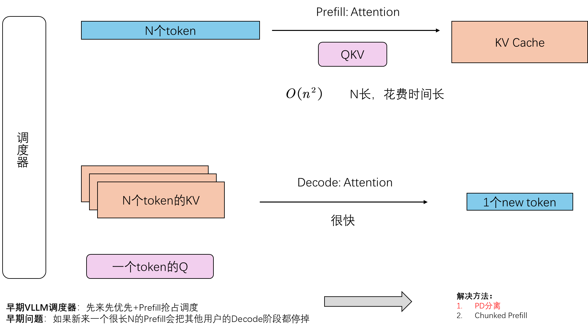

# Ref
1. [VLLM中的PD分离 B站](https://www.bilibili.com/video/BV1wcdbYwE6s?spm_id_from=333.788.videopod.sections&vd_source=8a4545c25a1c1192fb4e7e037876e6f4)
2. [PD分离 博客](https://johng.cn/ai/pd-separation)

# 概述
为了更便于理解Prefill和Decode是如何相互影响的，我计划引入PD分离的简述和科普。通过阅读本文可以更好的理解一个大模型推理框架是如何Prefill和Decode协助的，当然也可以更深入的理解`./05FastGen`中长序列场景下对于Prefill和Decode阶段互相影响的痛点

# 前言与动机

首先科普一下：

Prefill是N个token一起输入，它的attention主要是QKVSplit之后得到KVCache的过程。它的复杂度是$O(n^2)$，因此N越长花费时间越长。

Decode则是基于N个KVCache生成一个新token的过程，它的速度很快。

如图：

我们常用的大模型推理的框架就是通过调度器调度Prefill和Decode的两个过程。

然而，早期的VLLM的调度器是**先来先服务 + Prefill可以抢占Decode**的设计。这样的问题是，如果我有多个用户正在Decode等待生成相应，突然有新用户来了一个很长的Prefill请求，那么其他用户就不得不因此等待很长的时间（被抢占了）。

解决该问题主要当时提出的有PD分离和Chunked Prefill两个方法：Chunked Prefill主要是利用Prefill和Decode阶段低层算子的相似性尝试将两个阶段放到一起的方法，不在本文的讨论范围；本文主要介绍PD分离。

# 技术概述

既然我把Prefill和Decode都放到一个GPU上会资源竞争，那么我直接把P和D作为两个节点放到两个GPU上不就好啦？

没错！这就是PD分离的基本思想。也即把P节点和D节点放在两个GPU上，当P阶段进行完之后将结果传给D阶段。这样的话即便其他用户的Prefill来了因为你的D节点在其他GPU上进行的（分离了），所以不会影响你的Decode阶段。

# 核心问题

我们有了基本的技术思路，那么现在只需要解决这个思路的几个关键技术点就行了。

## P、D节点间如何传KVCache

- polling mode: P节点发送结果到pool，然后D节点从pool里面去取。（2次传输，代码相对简介）

- p2p mode: P节点知道自己发到哪个D节点，直接发送。（1次传输，代码设计也相对更难）

目前有些库实现了这些 mode：[LMCache](https://github.com/LMCache/LMCache)、[MoonCake](https://github.com/kvcache-ai/Mooncake)、[NIXL](https://github.com/ai-dynamo/nixl)，当然还有 [vLLM](https://github.com/vllm-project/vllm) 的 model_runner 模块。

## PD如何和VLLM交互

本质也即传输的KVCache如何被VLLM管理，VLLM会尝试为KVCache分配Paged Memory，并在需要的时候从Paged Memory中取出。更详细的过程可以看我这篇文章`./05-1 PagedAttention`。值得注意的是，PagedAttention也是我们本系列主体FastGen的背景解决技术和重要参考，学习本技术也有助于你理解整个FastGen的流程。

## VLLM何时发送请求

因为我们现在PD分离了，以往我们直接发一个request给一个instance然后直接执行就行了。但是现在我有P、D两个节点（两个instance），我希望它们都看到这个request。[VLLM社区](https://blog.vllm.ai/2025/09/05/anatomy-of-vllm.html)对此讨论了很多解决方法：

- 先P后D：也是最直观的方法，我先把request发给P节点让P节点得到结果再发给D节点。
- 先D后P：因为用户request本质是希望得到生成的token，因此也可以先发给D，当D发现自己无法生成token的时候再去向P节点请求KVCache。

# 结语

本文是一个PD分离简要介绍，旨在帮助你理解Prefill、Decode是什么，以及以VLLM为例的推理框架是如何调度它们的。理解完本文可以继续去看`./05FastGen`也即长序列情况下DeepSeed是如何应对PD调度的问题。

