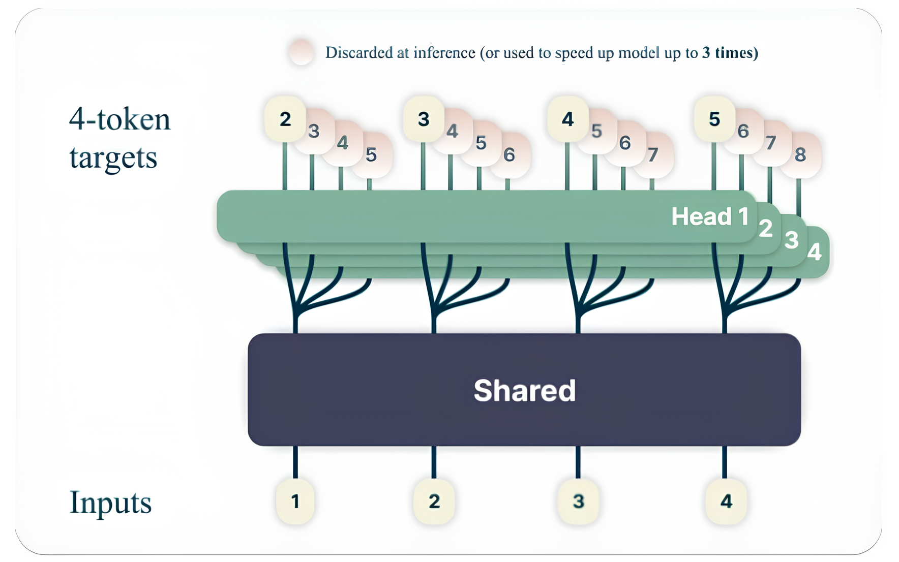
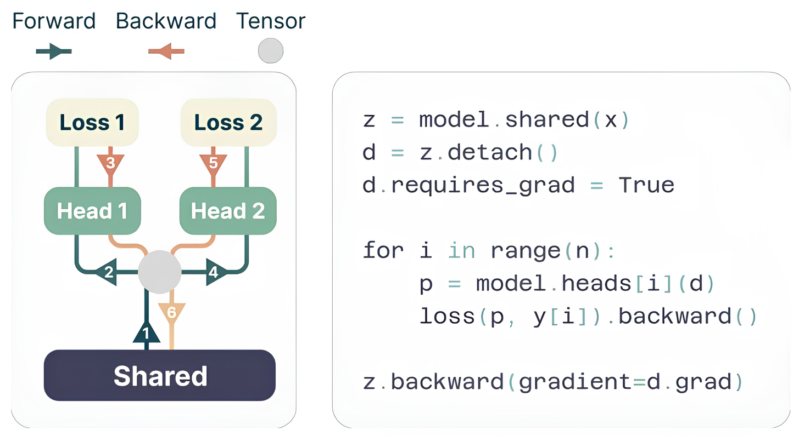
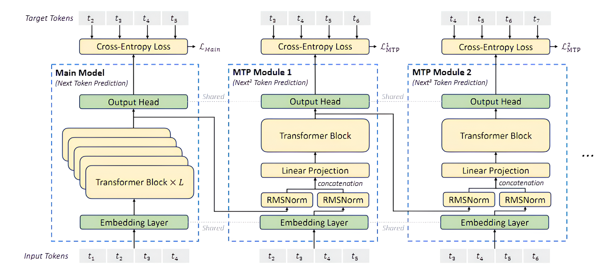

# 并行采样：深入解析 Multi-Token Prediction 与 Lookahead Decoding
> Author by：李文骁

在大语言模型（LLM）中，传统自回归解码（Autoregressive Decoding）每次仅能生成 1 个 Token，导致推理速度随生成序列长度线性增长。为解决这一问题，业界涌现出多种非自回归采样优化技术，比如Multi-Token Prediction 与 Lookahead Decoding.
## 一、Multi-Token Prediction（MTP）
### 1.1 MTP在训练阶段作用
MTP初衷是为了让LLM训练更高效。在传统LLM训练时，每一步只预测“下一个token”，而MTP则在每一步同时预测“接下来n个token”（比如一次预测3个），用多个独立的输出头并行计算。
例如，Meta在2024年发表的论文《Better & Faster Large Language Models via Multi-token Prediction》中，于共享权重层后接入多个单独的输出头，在每一步并行预测多个token，提升了模型的长序列预测能力。

其中每个输出头的输入均为上一层的输出特征，彼此权重独立更新，旨在学习多个token间的通用知识。

在DeepSeek-V3技术报告中显示，其进一步优化了MTP模块结构，用“级联模块”保持前后token预测的逻辑连贯——每个模块基于前一个模块的输出预测下一个token，保持因果关系，避免了生成序列前后矛盾。目前开源的llm模型（例如Qwen3-Next、GLM-4.5），训练时都加了MTP模块以提升性能。

### 1.2 MTP在推理阶段作用
MTP在推理阶段存在较多限制:
- 由于在训练时，每一个MTP模块只学习了基于前一模块输出特征的单步推理，在递归多步预测情况下（当前MTP模块输出，在下一轮作为自己的输入），输出分布会逐渐偏离训练目标，即随着mtp模块数增加，采纳率会迅速下降。
- MTP大多为“独立模块”设计：要预测3个token，就得加载3个MTP模块，每个模块有自己的权重和缓存。存在额外的内存占用，且预测调度以及kv cache的管理较为复杂复杂（比如要协调3个模块的计算顺序和kv cache细节）。
- 当前主流大模型(例如，deepseek v3、Qwen3-Next、GLM-4.5)的开源权重中，MTP头个数（num_nextn_predict_layers），均为1。

由于上述限制，在当前主流的开源推理框架（vllm和sglang）中，对于MTP加速推理这一特性，均仍采用“EAGLE-style”框架，即只使用一个MTP头作为草稿模型，按照要求生成k个待选token，再由主干模型验证并决定是否采纳。主体预测流程如下：

#### 1.2.1 验证前的前置步骤：草稿生成（Drafting Phase）
在每一轮的预测中，会根据需要额外预测的token数量k，通过**MTP头（Multi-Token Prediction Head）** 递归生成草稿序列，为后续验证做准备：
1. **初始token生成**：主模型先对输入序列 \(t_{1:i}\) 进行一次前向计算，生成第一个“已验证token” \(\hat{t}_{i+1}\)（作为草稿序列的起始锚点）。
2. **递归草稿生成**：MTP头以 autoregressive（自回归）方式递归生成 \(K\) 个草稿token（\(K\) 为预设的草稿深度）：
   - 第1步草稿（\(k=1\)）：MTP头接收主模型输出的隐藏状态 \(h_i\)，并结合“输入序列+已验证token”（\([t_{2:i};\hat{t}_{i+1}]\)）的嵌入，生成第一个草稿token \(\hat{t}_{i+2}\)。
   - 第\(k>1\)步草稿：MTP头复用前一步（\(k-1\)）输出的隐藏状态 \(\hat{h}_{i+k}\)，并结合前一个草稿token \(\hat{t}_{i+k}\) 的嵌入，生成第\(k\)个草稿token \(\hat{t}_{i+k+1}\)。
3. **最终草稿序列**：经过\(K\)步递归后，得到完整的草稿序列 \(\hat{t}_{i+2:i+K+1}\)（长度为\(K\)），与已验证token \(\hat{t}_{i+1}\) 共同组成待验证的“扩展序列”。

#### 1.2.2 主模型的验证流程（Verification Phase）
主模型对草稿序列的验证遵循**并行计算+严格接受准则**，确保输出分布与原始自回归解码完全一致（无损质量），具体步骤如下：

- 并行计算草稿token的logits
    主模型不再逐token进行自回归计算，而是一次性对所有草稿token进行**并行前向计算**：
    - 输入：将待验证的“扩展序列”（已验证token \(\hat{t}_{i+1}\) + 草稿序列 \(\hat{t}_{i+2:i+K+1}\)）输入主模型。
    - 并行计算：主模型对草稿序列对应的位置（\(i+2\) 到 \(i+K+1\)）同时计算logits（即每个位置的token概率分布），避免了传统自回归“一次一token”的串行开销。

- 基于严格准则的草稿接受判断
    验证的核心是判断草稿token是否与主模型“原生自回归生成的token”一致，采用**逐位置串行接受**策略（确保因果一致性）：
    - 接受准则：从第一个草稿token（\(\hat{t}_{i+2}\)）开始，依次对比“草稿token”与“主模型在该位置采样的top-1 token”（即主模型原生生成的token）：
    - 若一致：接受该草稿token，继续验证下一个。
    - 若不一致：立即停止验证，**仅接受前序一致的草稿token**，后续未验证的草稿token全部丢弃。
    - 理论保证：《Fast Inference from Transformers via Speculative Decoding》论文明确指出，该验证准则严格遵循推测解码的理论基础，可确保最终输出分布与原始主模型完全一致，无需额外评估生成质量。

- 验证后的序列延续
  - 若\(m\)个草稿token被接受（\(0 \leq m \leq K\)），则当前生成序列更新为 \(t_{1:i+1+m}\)（已验证token + \(m\)个接受的草稿token）。
  - 主模型以更新后的序列为输入，进入下一轮“草稿生成-验证”循环，直到达到预设的最大生成长度。

## 二、Lookahead Decoding

