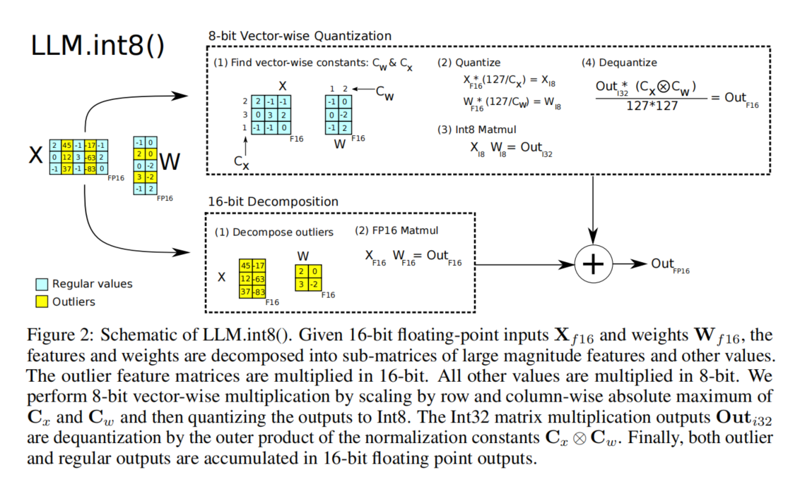

# 大模型量化：低精度量化

模型量化是一种参数压缩与加速技术，其核心逻辑是将模型中的高精度浮点数（如32位浮点数 FP32）转换为低精度整数（如8位整数 INT8 或4位整数 INT4），从而减少存储空间、提升推理速度并降低硬件能耗。 一个拥有70B（700亿）参数的模型，如果用FP32存储，需要 70B * 4字节 = 280 GB 的内存。将FP32转换为INT8，模型大小直接降为 70B * 1字节 = 70 GB；转换为INT4，则仅为 35 GB。这使得大模型能够在更广泛的硬件上运行。在推理过程中，巨大的模型参数也需要从GPU的显存中读取到计算核心（如CUDA Cores）中进行计算。内存带宽（如几百GB/s）相比计算速度而言是一个更稀缺的资源，经常成为性能瓶颈。更小的数据体积意味着在相同的带宽下，每秒可以传输更多的参数。这极大地缓解了带宽压力，从而提升推理速度。此外，使用INT8/INT4等整数格式，硬件可以在一个时钟周期内执行更多的操作（例如，一次INT8运算能处理比FP32多4倍的数据）。

## 数值格式结构对比

| 格式 | 总位数 | 符号位 (S) | 指数位 (E) | 尾数/小数位 (M) | 数值范围 (近似) | 内存占用 (相对于 FP32) | 主要用途与特点 |
| :--- | :--- | :--- | :--- | :--- | :--- | :--- | :--- |
| **FP32** | 32 bits | 1 bit | 8 bits | 23 bits | ±3.4 × 10³⁸ | 1x (基准) | 高精度计算，训练和推理的基准格式 |
| **BF16** | 16 bits | 1 bit | **8 bits** | **7 bits** | ±3.4 × 10³⁸ | **50%** | 训练加速，动态范围大，混合精度训练核心 |
| **INT8** | 8 bits | 1 bit | **无** | **7 bits (有效)** | -128 to 127 | **25%** | 推理加速，最常用的量化格式，效率与精度平衡 |
| **INT4** | 4 bits | 1 bit | **无** | **3 bits (有效)** | -8 to 7 | **12.5%** | 模型压缩，用于资源受限场景，需复杂量化技术 |

FP32是标准的单精度浮点数，是原始LLM模型权重和激活值的默认格式。浮点数FP的结构包含符号位 (Sign)、指数位 (Exponent) 和尾数位 (Mantissa/Fraction) 三部分。FP32的结构为：S(1) | E(8) | M(23)，其计算最精确，但计算速度和内存效率最低。

BF16指数位与FP32保持一致（8位），但大幅削减了尾数位（只有7位）。其结构为：S(1) | E(8) | M(7)。在混合精度训练中，前向和反向传播使用BF16，以减少内存占用和加速计算，而权重更新等关键操作仍可能使用FP32来保持数值稳定性。它本身也是一种“量化”形式(从FP32到BF16)，但通常不归入“低比特量化”的讨论范畴，后者特指INT8/INT4。

整数INT用于表示离散的整数值。其设计目的是精确存储整数，没有小数部分。结构通常只包含符号位(Sign)和数值位(Value)。INT8是非常流行的推理后量化格式，其结构为：S(1) | Value(7)。由于整数格式无法直接表示小数。为了用INT8来表示原本是浮点数的权重和激活值，需要引入量化参数(Scale, 有时还有Zero Point)。INT8量化可以将模型大小减少至原来的1/4，并显著提升推理速度（因为整数运算比浮点运算快得多）。通常会导致极小的精度损失，对于许多任务来说是可接受的。

INT4的结构为：S(1) | Value(3) 或使用更高级的编排方式（如GPTQ）。INT4量化后的每个参数只有16种可能的取值(-8到7)，其数值范围非常有限，精度损失风险极大。直接使用常规INT4量化会导致模型性能严重下降，在LLM中应用时通常需要更复杂的量化技术来弥补精度损失。

## 量化过程

模型量化的本质是通过数学映射，在精度损失可控的前提下，将模型参数从“高精度”转换为“低精度”，实现性能与效率的平衡。量化过程为：

1.确定数值的动态范围：要搞清楚数据中数值的变化范围。
2.选择缩放因子（Δ）：这个因子很关键，会影响量化的效果。
3.将浮点值映射为整数：按照规则把浮点形式的数字变成整数。
4.存储缩放因子用于反量化：方便之后把量化后的整数再变回浮点值。

## LLM.int8()量化
在Transformer模型中，前馈网络（FFN）和注意力投影层的矩阵乘法操作是内存消耗的主要开销来源，大概消耗了95%的参数资源和65%-85%的计算量。因此，降低这些线性层的内存占用是解决整个模型内存问题的关键。在现有的解决方案中，8-bit量化是减少内存占用的直接方法（将模型权重从16字节降至1字节，理论上内存减半）。但存在一些局限：(1)之前的8-bit量化方法（如Q8BERT）会导致模型性能（如准确率、困惑度）显著下降。(2)这些方法仅在小规模模型（< 350M参数） 上被验证有效，例如BERT。(3)这些方法量化后的模型通常需要量化感知训练或训练后微调来缓解性能损失，对于十亿级别以上的自回归模型（如GPT），无损的8比特量化是一个未解决的挑战。

LLM.int8()通过初步分析指出，当模型规模扩大到约6.7B参数时，所有Transformer层中都会涌现出数量稀少但绝对值极大的异常激活值（outliers）。这些异常值会破坏现有量化方法的精度，因为它们一个值就会挤占掉整个张量的量化区间，导致其他绝大多数数值的量化误差急剧增大。这是导致传统量化方法在大模型上失败的根本原因。总结来说，论文攻克了两个随着模型规模扩大而出现的技术难题：

1. **量化粒度粗糙，精度不足**  当模型参数规模超过10亿（1B）后，模型对量化误差变得极为敏感。此前适用于小规模模型的粗粒度量化方案（如整个张量使用单个缩放因子）会引入过大误差，导致模型性能显著下降，具体表现为模型困惑度（PPL）上升，零样本任务准确率下降。因此，需要一种更精细、更高精度的量化策略。

2. **系统性大幅度异常值的涌现** 当模型规模达到约67亿（6.7B）参数时，在所有Transformer层中，会涌现出稀疏但系统性的异常特征值（outlier features）。这些异常值在数量上仅占所有特征值的约0.1%，它们并非随机出现，而是高度集中并持续存在于极少数（约6-7个）特定的特征维度上，其数值幅度可达其他正常值的20倍以上。传统的量化方法无法有效处理这些异常值，一个异常值就会占据INT8数据类型的大部分表示范围，从而严重压缩其他绝大多数正常值的量化空间，导致量化精度整体崩溃。

### 核心创新点
LLM.int8()对Absmax和Zeropoint两种主流8比特量化方案进行了分析，无论是Absmax还是Zeropoint，传统方法都为整个权重或激活张量使用单个缩放因子，一个异常值就会降低该张量中所有其他数值的量化精度。论文作者发现，异常值特征首次出现在约2.7B参数的模型中，但此时仅影响约25%的层。而在6.7B参数时，发生相变，异常值迅速扩散到100%的Transformer层和约75%的序列位置。虽然每层、每个序列位置都可能出现异常值，但这些异常值都高度集中在固定的、极少数的几个特征维度上。例如，在一个6.7B的模型中，虽然每层、每个序列位置都有异常值，但所有这些异常值都来自于相同的6个特征维度（即 hidden state 向量中的第i个、第j个...维度）。这意味着整个模型都学会了在这几个特定的“通道”上传递和放大重要的信息。消融实验表明，这些只占0.1%的异常值特征维度，是模型存储和传递最关键信息的关键维度。对于异常值特征的量化精度至关重要，即使是微小的误差也会极大地影响模型性能。此外，异常值的分布是高度不对称的。在一个给定的特征维度上，异常值几乎全是正数或全是负数。这个特性解释了为什么非对称的zeropoint量化在较小模型（6.7B以下）上比对称的absmax量化表现更好，因为它能更充分地利用INT8的表示范围。

依据这些发现，论文提出了向量级量化 (Vector-wise Quantization)和混合精度分解以解决大规模Transformer模型的量化问题。主要思路为，既然只有约0.1%的特征是麻烦的异常值，那就只把它们“挑”出来，隔离到单独的通道中，用高精度（FP16）进行处理。剩下的99.9%的正常值，则使用高效的INT8处理。在异常值被分离后，对正常值的量化可以做得更精细。为矩阵乘法的每一行（输入）和每一列（权重）使用独立的缩放因子，而不是整个张量共享一个因子。这样既保证了关键信息无损，又实现了大幅的内存节省。

向量级量化将矩阵乘法视为一系列内积。为输入矩阵的每一行和权重矩阵的每一列分别分配独立的缩放因子。反量化时，使用这些因子外积的倒数进行缩放。这大大减小了量化块的大小，限制了异常值的负面影响范围。

为了处理参数规模在 6.7B 之上的所有 Transformer 中出现的大幅度异常值特征，论文中使用了混合精度分解，该方法不强迫所有计算都在8位下进行，而是智能地将计算分解。将少量大幅值的特征维度 (≈0.1%) 以 16-bit 精度表示，而其他 99.9% 的正常值进行 8-bit 运算。由于大多数的值仍然以低比特表示，因此与 16-bit 相比，降低了大约 50% 的显存。例如，对于 BLOOM-176B，将模型的显存占用减少了 1.96 倍。

LLM.int8()方法是 Absmax Vector-wise 量化和混合精度分解的组合，其结构如图1所示。
<figure style="text-align: center;">
    
</figure>
### 计算过程

#### 1. 异常值特征检测与分解

目标：识别并分离出输入激活值中数量稀少但幅度巨大的异常值特征维度，这些维度对模型性能至关重要，但会破坏量化精度。

输入：FP16的输入激活矩阵 $\mathbf{X}_{f16} \in \mathbb{R}^{s \times h}$ 和权重矩阵 $\mathbf{W}_{f16} \in \mathbb{R}^{h \times o}$。
检测：设定幅度阈值 $\alpha$ (论文中 $\alpha = 6.0$)。扫描 $\mathbf{X}_{f16}$，找出所有在任意序列位置上绝对值 $|\mathbf{X}_{f16}^{ij}| \geq \alpha$ 的**特征维度（列）**。这些维度被归入异常值集合 $O$。
  -**分解**：将原始的矩阵乘法分解为两部分：
  - **异常值部分**：在集合 $O$ 中的特征维度。
  - **正常值部分**：不在集合 $O$ 中的特征维度（占99.9%）。

#### 2. 向量级INT8量化与计算（针对正常值部分）

此步骤旨在对99.9%的正常值进行高精度、高效率的INT8计算。

a. 向量级量化

为输入矩阵的每一行和权重矩阵的每一列分配独立的缩放因子，实现更精细的量化。

- **计算行/列缩放因子**：
  对于输入矩阵 $\mathbf{X}_{f16}$ 的每一行 $i$，和权重矩阵 $\mathbf{W}_{f16}$ 的每一列 $j$，分别计算其绝对值最大值，并导出缩放因子：
  $$
  c_{x_i} = \frac{127}{\max(|\mathbf{X}_{f16}[i, :]|)}
  $$
  $$
  c_{w_j} = \frac{127}{\max(|\mathbf{W}_{f16}[:, j]|)}
  $$

- **量化**：
  使用各自的缩放因子对每一行和每一列进行量化（$\lfloor \cdot \rceil$ 表示四舍五入到最近的整数）：
  $$
  \mathbf{X}_{i8}[i, :] = \lfloor c_{x_i} \cdot \mathbf{X}_{f16}[i, :] \rceil
  $$
  $$
  \mathbf{W}_{i8}[:, j] = \lfloor c_{w_j} \cdot \mathbf{W}_{f16}[:, j] \rceil
  $$

b. INT8矩阵乘法与反量化

- **INT8矩阵乘**：
  将量化后的INT8矩阵相乘，结果累加到INT32中以防止溢出：
  $$
  \mathbf{C}_{i32} = \mathbf{X}_{i8} \times \mathbf{W}_{i8}
  $$

- **反量化**：
  使用缩放因子外积的倒数，将INT32结果反量化为FP16范围的近似值：
  $$
  \mathbf{C}_{normal} \approx \frac{1}{\mathbf{c}_x \otimes \mathbf{c}_w} \cdot \mathbf{C}_{i32}
  $$
  其中 $\mathbf{c}_x \otimes \mathbf{c}_w$ 是行缩放因子向量和列缩放因子向量的外积，形成一个缩放矩阵。

#### 3. 混合精度计算与结果融合

目标：将高精度处理的异常值部分与高效率处理的正常值部分合并，得到无损的最终结果。

- **异常值部分（FP16计算）**：
  仅选取异常值特征维度对应的列，进行完整的FP16精度矩阵乘法：
  $$
  \mathbf{C}_{outlier} = \sum_{h \in O} \mathbf{X}_{f16}^{h} \times \mathbf{W}_{f16}^{h}
  $$

- **正常值部分（INT8计算）**：
  即为上一步反量化后的结果 $\mathbf{C}_{normal}$。

- **结果融合**：
  将两部分的结果相加，得到最终的FP16输出：
  $$
  \mathbf{C}_{f16} = \mathbf{C}_{outlier} + \mathbf{C}_{normal}
  $$


### 适用阶段及策略
LLM.int8()主要就是为推理阶段设计的。对于训练和微调，它主要作为一种辅助工具，与LoRA等技术结合使用，而非独立的全参数训练解决方案。

#### 例子：在资源受限的GPU上运行大模型
场景：在单张 RTX 3090（24GB） 上运行 OPT-30B 模型。

问题：OPT-30B的FP16模型需要约60GB内存，无法装入24GB显存。

策略：使用 LLM.int8() 进行量化。

操作：

```python
from transformers import AutoModelForCausalLM

model = AutoModelForCausalLM.from_pretrained(
    "facebook/opt-30b",
    device_map="auto",  # 使用Accelerate进行多GPU自动分布
    load_in_8bit=True,  # 核心：启用LLM.int8()量化
)

```
结果：模型内存占用降至约30GB，可以装入两张RTX 3090(或通过 device_map="auto" 在单张卡上加载大部分层)。

#### 适用策略
根据论文附录D和E的实验，策略如下：

-1.**仅量化前馈网络层**

 发现：将FFN层量化为8-bit对性能影响很小，甚至在有些情况下能稳定训练。

 策略：在训练中，可以尝试只将FFN层转换为INT8，而保持注意力层的精度为FP16。这是一个保守但安全的起点。

-2.**提高混合精度分解的比率**

 发现：在训练中，仅仅分离0.1%的异常值维度可能不够。需要提高分解比率（例如，将前1%或2%的最大幅度特征维度都用FP16计算），才能稳定训练。

 策略：在训练循环中，使用一个更高的 decomposition percentage 阈值。但这需要修改底层代码，目前并非开箱即用功能。

-3.**主要用于全参数微调**

 策略：对于像 LoRA 这样的参数高效微调方法，由于其本身只训练极少量参数，内存节省的主要来源是优化器状态而非模型权重。因此，使用 LLM.int8() 量化基础模型，再结合 LoRA 进行微调，是一个非常强大且推荐的组合策略，可以同时在微调和推理中节省内存。

## Int4量化
### 计算过程

### 适用阶段及策略


## 混合精度量化
### 计算过程

### 适用阶段及策略
